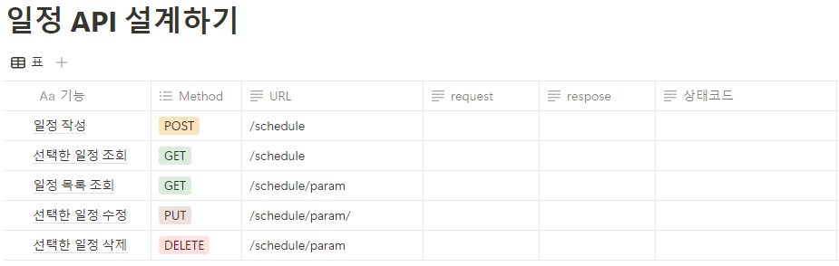

# 📖 **주특기 입문 주차 개인과제**

## 🗓️ **나만의 일정 관리 앱 서버 만들기**

### 목표
1. 구현하고자 하는 서비스의 전체적인 흐름을 파악하고 필요한 기능을 설계할 수 있습니다.
2. API 명세서, ERD, SQL을 작성할 수 있습니다.
3. Spring Boot를 기반으로 CRUD(Create, Read, Update, Delete) 기능이 포함된 REST API를 만들 수 있습니다.

# 📖 **API 설계**

# 📖 **ERD 작성**

# 📖 **SQL 작성**

